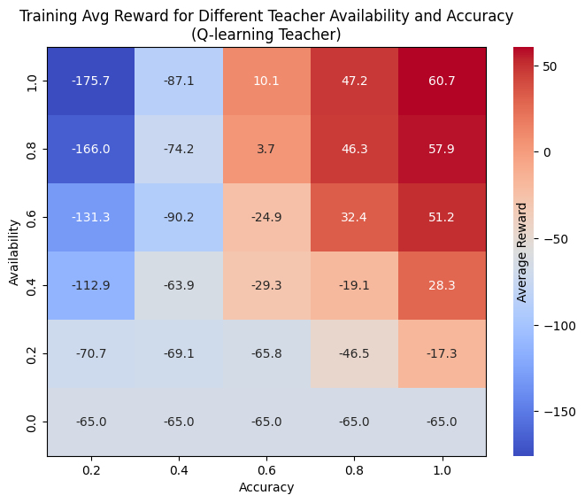
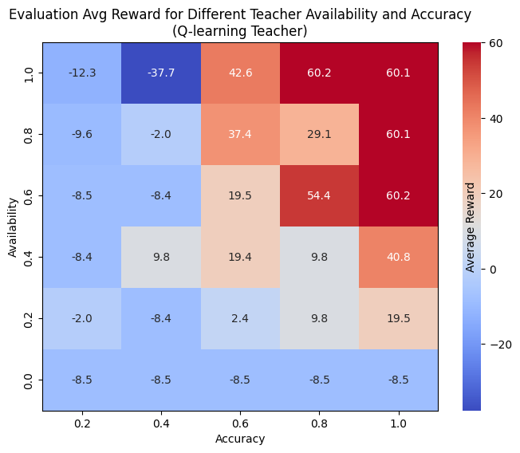
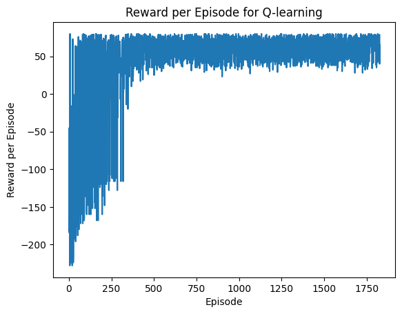

# Q-Learning Agent with Optional Teacher Guidance

This project implements a Q-learning agent in a grid-based environment with optional teacher advice. The agent learns through trial and error and can optionally receive guidance from a "teacher" with controllable availability and accuracy.

## Features

- Standard Q-learning training and evaluation
- Optional teacher guidance with adjustable availability and accuracy
- Evaluation of agent performance under different guidance configurations
- Optional rendering support for visualizing the environment

## Requirements

Install the dependencies using:

```bash
pip install numpy
```

If you want to enable environment rendering during evaluation:

```bash
pip install pygame
```

## File Structure

- `teach.py`: Main script containing training and evaluation logic.
- `environment.py`: Defines the custom environment.Includes `reset()`, `step()`, `render()`, and attributes like `grid_size` and `action_space`.

## How to Train and Evaluate

### 1. Train without Teacher

```python
from teach import train_agent

q_table, rewards, success_rate, avg_steps = train_agent(max_total_steps=10000)
```

### 2. Train with Teacher

```python
from teach import train_agent_with_teacher

q_table, avg_reward, success_rate, avg_steps = train_agent_with_teacher(
    teacher_q_table=teacher_q_table,
    max_total_steps=10000,
    availability=0.5,
    accuracy=0.8
)
```

### 3. Evaluate

```python
from teach import evaluate_agent

avg_reward, success_rate, avg_steps = evaluate_agent(q_table, max_total_steps=1000, render=True)
```

### 4. Evaluate Over Teacher Availability and Accuracy

```python
from teach import evaluate_agent_with_teacher

records, train_matrix, eval_matrix = evaluate_agent_with_teacher(
    teacher_q_table=teacher_q_table,
    TEACHER_AVAILABILITY=[0.0, 0.5, 1.0],
    TEACHER_ACCURACY=[0.5, 0.75, 1.0]
)
```

## Visualizations

### 📈 Plot 1: Training Rewards over Episodes



---

### 📊 Plot 2: Teacher Availability vs Evaluation Reward



---

### 🎯 Plot 3: Teacher Accuracy vs Evaluation Reward



---

## Notes

- The teacher provides action advice based on its own Q-table.
- Teacher guidance is controlled using `availability` (probability of being available) and `accuracy` (probability of giving the correct advice).
- Rendering the environment is optional and controlled by `render=True` during evaluation.

---

## License

IIIT Hyderabad

